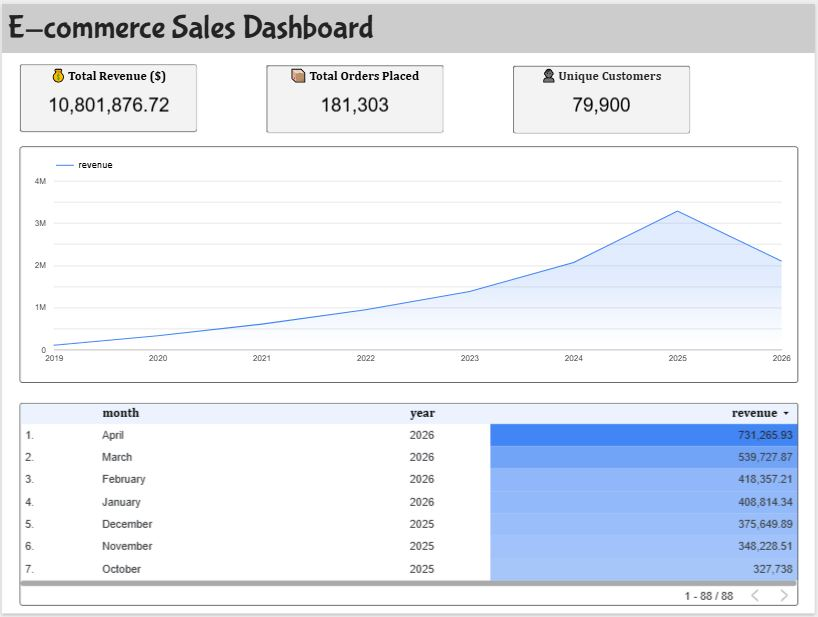

# 📊 E-commerce Sales Dashboard (BigQuery + Looker Studio)

## 🚀 Project Overview

This project analyzes e-commerce sales data using **Google BigQuery** and visualizes insights using **Looker Studio**.

---

## 📌 Key Insights

* 💰 Total Revenue: 10.8M+
* 📦 Total Orders: 181K+
* 👥 Unique Customers: 79K+

---

## 📈 Dashboard Preview

---

## 🛠️ Tech Stack

* Google BigQuery (SQL)
* Looker Studio
* SQL (CTE, Aggregations)

---

## 📂 SQL Queries

All queries used in this project are available in the `/sql` folder:

* customer_revenue.sql
* monthly_sales.sql
* top_products.sql

---

## 🔗 Dataset

Public dataset used:
`bigquery-public-data.thelook_ecommerce`

---

## 🎯 What I Learned

* Writing analytical SQL queries
* Building datasets in BigQuery
* Creating dashboards in Looker Studio

---

## 🔗 Live Dashboard
[https://dashboard](https://datastudio.google.com/u/0/reporting/f8a3f889-d2f9-44f6-a472-e0add0083d52/page/krevF/edit)

---

## 🔗 Connect with Me

If you liked this project, feel free to connect!
